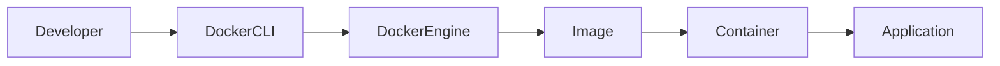

# 🐳 Docker Basics

> **Module 1 - TESRECO DevOps Labs**
>
> **Estimated Time:** 45-60 Minutes
>
> **Difficulty:** ⭐ Beginner

---

# Learning Objectives

After completing this lab, you will be able to:

- Understand what Docker is
- Understand Images vs Containers
- Pull Docker images
- Run containers
- Expose ports
- View logs
- Execute commands inside containers
- Stop and remove containers
- Understand volumes
- Understand Docker networking
- Debug basic Docker problems

---

# Why Docker?

Imagine every developer has a different laptop.

Developer A

- Ubuntu
- Python 3.12

Developer B

- Windows
- Python 3.9

Developer C

- MacOS
- Python 3.11

Will the application always behave exactly the same?

**No.**

Different operating systems and software versions create the famous problem:

> **"It works on my machine."**

Docker solves this problem by packaging:

- Application
- Runtime
- Dependencies
- Libraries
- Configuration

inside a single portable unit called a **Container**.

Run it anywhere.

---

# Docker Architecture



---

# Image vs Container

This is the most important Docker concept.

## Docker Image

Think of an Image as:

> A recipe

or

> A class in Java

It is **read-only**.

Examples

- nginx
- mysql
- redis
- ubuntu

---

## Docker Container

A Container is

> A running instance of an Image.

Just like

Java Class → Object

Docker Image → Container

One image can create many containers.

Example

```
nginx Image

        |
   --------------------
   |        |         |
Container1 Container2 Container3
```

---

# Verify Docker Installation

Run

```bash
docker version
```

Expected Output

```
Client:
 Version: xx.xx.xx

Server:
 Engine:
 Version: xx.xx.xx
```

---

Check Docker is running

```bash
docker info
```

---

# Pull Your First Image

Let's download Nginx.

```bash
docker pull nginx
```

Docker downloads the image from Docker Hub.

Verify

```bash
docker images
```

Example

```
REPOSITORY   TAG      IMAGE ID

nginx        latest   xxxxxxxxx
```

---

# Run Your First Container

```bash
docker run nginx
```

Oops!

It starts and immediately exits because Nginx is running in the foreground.

Press

```
CTRL + C
```

---

Run it in background

```bash
docker run -d nginx
```

---

Check running containers

```bash
docker ps
```

Example

```
CONTAINER ID

7db3......

IMAGE

nginx

STATUS

Up 20 seconds
```

---

Show all containers

```bash
docker ps -a
```

---

# Name Your Container

Instead of random IDs

```bash
docker run -d --name web nginx
```

Now

```bash
docker ps
```

shows

```
web
```

instead of

```
b73d91af4...
```

Much easier.

---

# Expose Ports

Containers are isolated.

To access Nginx

```bash
docker run -d \
--name web \
-p 8080:80 \
nginx
```

Meaning

```
Host Port

8080

↓

Container Port

80
```

Open

```
http://localhost:8080
```

You should see

```
Welcome to nginx!
```

---

# List Images

```bash
docker images
```

---

# List Running Containers

```bash
docker ps
```

---

# List All Containers

```bash
docker ps -a
```

---

# View Logs

Every container writes logs.

```bash
docker logs web
```

Follow logs

```bash
docker logs -f web
```

Stop following

```
CTRL + C
```

---

# Execute Commands Inside Container

Open shell

```bash
docker exec -it web sh
```

Now you're inside the container.

Try

```bash
pwd

ls

cat /etc/os-release

hostname
```

Exit

```bash
exit
```

---

# Inspect Container

```bash
docker inspect web
```

This shows

- Network
- Volumes
- Ports
- Environment Variables
- Image
- Labels

Useful for debugging.

---

# Stop Container

```bash
docker stop web
```

Verify

```bash
docker ps
```

---

# Start Existing Container

```bash
docker start web
```

---

# Restart Container

```bash
docker restart web
```

---

# Remove Container

First stop it

```bash
docker stop web
```

Remove

```bash
docker rm web
```

---

# Remove Image

```bash
docker rmi nginx
```

If image is used by a container

Docker refuses.

Remove the container first.

---

# Docker Volumes

Containers are temporary.

If the container is deleted

its files disappear.

Volumes preserve data.

Example

```bash
docker volume create mysql-data
```

List volumes

```bash
docker volume ls
```

Inspect

```bash
docker volume inspect mysql-data
```

---

# Docker Networks

Every container receives its own IP.

List networks

```bash
docker network ls
```

Inspect

```bash
docker network inspect bridge
```

---

# Useful Cleanup Commands

Remove stopped containers

```bash
docker container prune
```

Remove unused images

```bash
docker image prune
```

Remove unused volumes

```bash
docker volume prune
```

Remove everything unused

```bash
docker system prune
```

---

# Complete Lifecycle

```text
docker pull nginx

↓

docker run

↓

docker ps

↓

docker logs

↓

docker exec

↓

docker stop

↓

docker rm

↓

docker rmi
```

---

# Mini Exercise 1

Run an nginx container

Requirements

- Name: web
- Port: 8080

Verify

- docker ps
- Browser

---

# Mini Exercise 2

Open shell inside container

Run

```bash
hostname

pwd

ls /
```

Exit container.

---

# Mini Exercise 3

Restart container.

Verify uptime changes.

---

# Mini Exercise 4

Delete the container.

Delete the image.

Verify

```bash
docker ps -a

docker images
```

---

# Common Errors

## Port already allocated

```
Bind for 0.0.0.0:8080 failed
```

Solution

Find process

```bash
docker ps
```

or use another port

```bash
-p 8081:80
```

---

## Container exits immediately

Check

```bash
docker logs <container>
```

---

## Image not found

```
Unable to find image
```

Run

```bash
docker pull <image>
```

---

## Permission denied

Linux users

```bash
sudo docker ps
```

or configure Docker group.

---

# Interview Questions

### What is Docker?

### Difference between Image and Container?

### Why Docker is faster than Virtual Machines?

### What is a Volume?

### What is a Docker Network?

### Difference between

```
docker run

docker start
```

### Difference between

```
docker stop

docker kill
```

### Difference between

```
docker exec

docker attach
```

---

# Key Takeaways

✅ Docker packages applications with all dependencies.

✅ Images are templates.

✅ Containers are running instances.

✅ Containers are isolated.

✅ Volumes persist data.

✅ Networks allow containers to communicate.

---

# What's Next?

In the next lab (**02-docker-compose.md**), you'll learn how to run **multiple containers together** (Application + Database + Redis) using **Docker Compose**, which is the foundation for the DevOps demo application in this repository.
